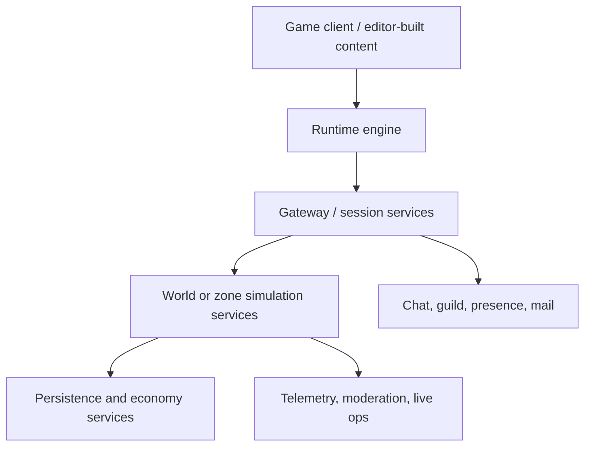

# MMORPG Engine Extraction

This document turns O3DE study into engine-design decisions. The point is not to copy O3DE whole. The point is to use O3DE as a reference implementation for engine architecture and then decide what your own MMORPG engine should keep, simplify, replace, or move outside the engine entirely.

Companions:

- [Main tutorial](./o3de-engine-study-tutorial.md)
- [Staged labs](./staged-labs.md)
- [90-day roadmap](./90-day-roadmap.md)

## The Core Rule

Your future MMORPG project is not just "an engine with networking." It is:

- a runtime engine
- a content pipeline
- game simulation code
- networking and replication logic
- backend services
- operations and live tooling

O3DE helps most with the first three and part of the fourth. It helps much less with the last two.

## Keep

These are the O3DE ideas most worth carrying into your own engine, even if the exact implementation is different:

- Layered foundations. O3DE's separation between `AzCore`, `AzFramework`, and higher feature layers is a strong model.
- Asset pipeline as a first-class system. The Asset Processor and builder pattern are essential lessons.
- Clear renderer layering. Atom's split between RHI and RPI is architecturally valuable.
- Tool/runtime separation. `AzToolsFramework`, `Code/Editor`, and `Code/Tools` show healthy boundaries.
- Modular feature packaging. The Gem model is a good reminder that not every capability belongs in the deepest core.
- Tests as subsystem documentation. O3DE's tests are often some of the best explanations of intent.

Recommendation:

Keep these principles even if your v1 implementation is much smaller.

## Simplify

These are ideas to preserve in spirit but reduce heavily for a first custom engine:

- Reflection depth. O3DE's reflection system is powerful, but your first engine may need only serialization and editor metadata.
- Tool surface area. O3DE supports a large editor and many utilities; your first engine can start with much narrower tooling.
- Render feature breadth. You do not need a giant feature matrix to build an MMO-capable engine.
- Template and packaging variety. O3DE supports many templates and target patterns; your first engine can standardize on one or two.
- Asset pipeline breadth. Start with the asset types you actually need for your game.
- Runtime target matrix. You may not need the full spread of platform and launcher combinations early.

Recommendation:

Keep the boundaries, not the size.

## Replace

These are areas where you may learn more from O3DE's structure than from its exact implementation:

- Multiplayer architecture details. O3DE's built-in multiplayer model is useful to study, but your game's authority, persistence, and session model may demand a different shape.
- Some modularization choices. Gems are helpful conceptually, but your own codebase may prefer a simpler package boundary at first.
- Editor assumptions. O3DE's editor is powerful, but you may want a smaller authoring surface or a very different workflow.
- Rendering specifics. Atom is worth studying, but your engine may use a narrower rendering abstraction and fewer data-driven layers.
- Legacy accommodation. O3DE carries historical weight and broad community needs; your engine should not copy those constraints.

Recommendation:

Replace implementation details that are driven by O3DE's product history rather than your game's needs.

## Missing Outside The Engine

This is the most important bucket for an MMORPG builder. Many MMO-critical systems do not belong inside the game engine executable at all.

You will still need architecture for:

- persistence and durable game state
- account, authentication, entitlement, and identity services
- inventory, economy, and transactional systems
- character services
- shard or world process management
- zone transfer or world handoff logic
- backend orchestration and deployment
- patching, telemetry, and live operations
- customer support, moderation, and administrative tooling
- social systems such as chat, guilds, mail, and presence

These systems may talk to the engine, but they are not solved by the engine alone.

Recommendation:

Design the engine-service boundary early, even if the first version of the backend is simple.

## A Practical First Engine Boundary

A realistic first custom engine for an MMORPG project might own:

- windowing and platform layer
- scene graph or entity/component runtime
- content loading and asset pipeline
- renderer
- local simulation
- animation
- terrain and navigation support
- client-side and server-process-side replication primitives

It might deliberately not own, at least at first:

- long-term persistence
- account systems
- matchmaking
- patch and deployment orchestration
- social graph and chat infrastructure
- commerce and economy backends

This is not "less serious." It is the correct separation of concerns.

## A Good v1 Scope

If your end goal is your own MMORPG engine, a sane v1 might be:

- one client runtime
- one dedicated world/server runtime
- one small asset pipeline
- one clear content format path
- one renderer path
- one replication model
- one persistence bridge

That is still a large project. O3DE is useful because it teaches structure, not because it makes that project small.

## Questions To Revisit While Studying

After each major subsystem, ask:

- Is this an engine concern, a game concern, or a service concern?
- Do I need this in v1, or only eventually?
- Is the O3DE solution valuable because of principle or because of scale?
- What is the smallest version of this idea that would still support my game?

Use the answers to refine your cut list during [Lab 6](./staged-labs.md#lab-6-write-your-mmorpg-engine-cut-list).
