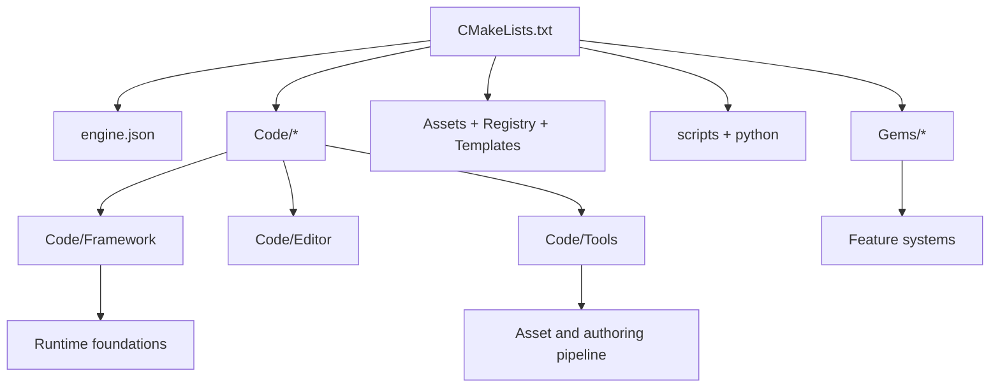
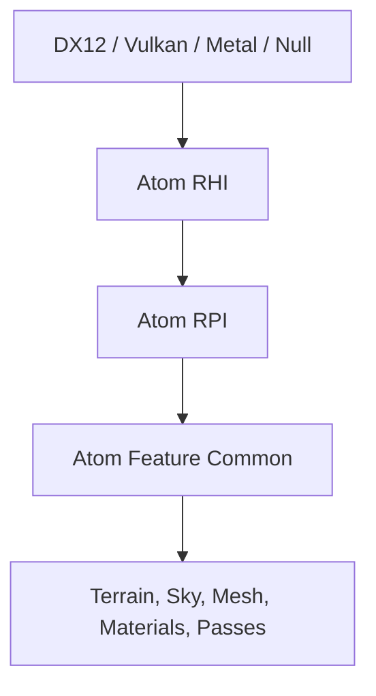

# O3DE Engine Study Tutorial

This tutorial is a guided path through O3DE as a real engine codebase, not as a marketing surface. The goal is to understand how O3DE is composed, why its subsystems exist, and what architectural lessons are worth carrying into a future MMORPG-oriented engine of your own.

Use this together with the [glossary](./glossary-and-concepts.md), [repo map](./repo-map-and-reading-order.md), [staged labs](./staged-labs.md), and [MMORPG extraction guide](./mmorpg-engine-extraction.md).

## How To Read This Tutorial

- Read one chapter at a time with the repository open.
- Follow the "Where to start reading" pointers before diving deeper.
- Do the short exercise at the end of each chapter.
- Write down what you would keep, simplify, or reject for your own engine.

## 1. O3DE As A Codebase And Product

O3DE is not a single executable. It is a codebase made from framework libraries, feature [Gems](./glossary-and-concepts.md#gem), tool applications, runtime [Launchers](./glossary-and-concepts.md#launcher), generated and static [modules](./glossary-and-concepts.md#module), templates, and data-driven configuration via the [Settings Registry](./glossary-and-concepts.md#settings-registry).

The root `CMakeLists.txt` is the most honest summary of the product. It initializes the CMake system, includes engine-wide build logic, then pulls in `Assets`, `Code`, `python`, `Registry`, `scripts`, `Templates`, and `Tools`. That already tells you something important: O3DE treats runtime, tools, and project scaffolding as first-class parts of the engine.

The other anchor file is `engine.json`. It tells you which built-in external subdirectories, templates, projects, and Gems are part of the engine distribution. Read it as the engine's manifest of built-in extension points and default capabilities.

O3DE is also layered socially, not just technically:

- engine/framework maintainers work on reusable foundations
- feature teams work in Gems
- tool builders work on the authoring pipeline
- game teams consume the engine through projects, Gems, templates, and launcher targets

That separation is valuable because large engine codebases fail when everything is equally "core."

### Why This Subsystem Exists

This top-level structure exists to keep O3DE usable as both an engine product and a development platform. You need to be able to build and ship runtime applications, author content in tools, process assets into runtime products, and extend the engine without rewriting the root.

### Where To Start Reading In The Repo

- `CMakeLists.txt`
- `engine.json`
- `Code/CMakeLists.txt`
- `Code/Framework/CMakeLists.txt`
- `Code/LauncherUnified`
- `Templates/UnifiedMultiplayerGem/Template/README.md`

### Design Lessons For Your Own Engine

- Keep the root honest. Your build entrypoint should clearly show the major product areas.
- Separate engine foundations from optional feature packages early.
- Treat tools and asset processing as part of the engine, not as afterthoughts.
- Keep extension boundaries explicit, even if your first version is much smaller than O3DE.

### Study Exercise

Write a one-page summary of the repo from only `CMakeLists.txt` and `engine.json`. If someone asked "what ships with this engine besides the runtime," your summary should answer that clearly.

## 2. Core Runtime Foundations: AzCore, AzFramework, AzGameFramework

The best place to start learning O3DE internals is `Code/Framework`. This directory contains the reusable libraries that most of the rest of the repo depends on.

At a high level:

- `AzCore` is the lowest-level engine foundation.
- `AzFramework` builds on it with engine-facing systems that are more aware of assets, application flow, input, scenes, networking, and tooling boundaries.
- `AzGameFramework` is a thinner gameplay-facing layer on top.

Inside `AzCore`, look for building blocks such as memory, math, jobs, threading, serialization, interface patterns, RTTI, and the [reflection](./glossary-and-concepts.md#reflection) system. Also pay close attention to the [EBus](./glossary-and-concepts.md#ebus) model and the tests under `Code/Framework/AzCore/Tests`, because the tests often explain intent more clearly than a single header file can.

Inside `AzFramework`, notice how O3DE starts to talk about application-level concerns:

- asset handling
- components
- entity and scene-related utilities
- input
- windowing
- spawnables
- physics and terrain integration points

`AzGameFramework` is useful because it shows where O3DE chooses to stop building "pure engine" abstractions and start providing more game-facing runtime helpers.

This is one of the biggest lessons in the whole codebase: O3DE does not try to put all meaning into the lowest layer. It keeps the lower layers reusable and pushes many concrete capabilities upward.

### Why This Subsystem Exists

Framework libraries exist so the engine can share stable foundations across runtime, editor, tools, and Gems without making every feature team reinvent the same primitives.

### Where To Start Reading In The Repo

- `Code/Framework/CMakeLists.txt`
- `Code/Framework/AzCore/AzCore`
- `Code/Framework/AzCore/Tests`
- `Code/Framework/AzFramework/AzFramework`
- `Code/Framework/AzGameFramework/AzGameFramework`

Good first test files:

- `Code/Framework/AzCore/Tests/EBus.cpp`
- `Code/Framework/AzCore/Tests/Components.cpp`
- `Code/Framework/AzCore/Tests/EntityTests.cpp`
- `Code/Framework/AzCore/Tests/Serialization.cpp`

### Design Lessons For Your Own Engine

- Keep your lowest layer small and dependency-light.
- Make core patterns readable in tests, not just in headers.
- Separate general-purpose runtime infrastructure from gameplay policy.
- Do not put rendering, editor, and networking assumptions into your deepest core unless you truly need them there.

### Study Exercise

Trace one concept through `AzCore` and the tests. Good candidates are entity lifecycle, EBus messaging, or serialization. Write down what problem the abstraction solves and what complexity it introduces.

## 3. Editor And Tools Architecture

An MMORPG engine is not just a runtime. It is an authoring environment. O3DE reflects this by putting substantial weight into `Code/Editor`, `Code/Tools`, and `AzToolsFramework`.

`AzToolsFramework` is the bridge layer between engine systems and editor/tool workflows. It is where you start seeing patterns that exist because people need to inspect data, edit content, serialize authoring state, build inspectors, and run engine-aware tooling without booting the whole game.

`Code/Editor` contains the main editor application and associated plugins, UI, asset browser functionality, import flows, command systems, and component/entity editing. This code matters even if you never plan to copy the editor, because it shows how O3DE separates authoring-time behavior from runtime behavior.

`Code/Tools/ProjectManager` is also revealing. Its CMake target shows that the Project Manager is a real Qt and Python-aware application that depends on `AzCore`, `AzFramework`, and `AzToolsFramework`. That tells you O3DE treats project lifecycle management as part of the platform, not just a shell script.

### Why This Subsystem Exists

Editor and tool layers exist because serious engines need structured authoring, inspection, import, validation, and project management workflows. Without this, the runtime becomes hard to feed and hard to operate.

### Where To Start Reading In The Repo

- `Code/Framework/AzToolsFramework/AzToolsFramework`
- `Code/Editor`
- `Code/Editor/Plugins`
- `Code/Tools/ProjectManager`
- `Code/Tools/ProjectManager/CMakeLists.txt`
- `Code/Tools/SceneAPI`

### Design Lessons For Your Own Engine

- Keep authoring-time code out of your runtime core where possible.
- Build a tool bridge layer instead of coupling every editor feature directly to runtime internals.
- Treat project setup, asset inspection, and content validation as platform features.
- For your first engine, start with fewer tools than O3DE, but keep the boundary clean so tools can grow later.

### Study Exercise

Compare `AzFramework` and `AzToolsFramework`. Write a short note on what belongs in a shared runtime-facing layer and what belongs only in tools.

## 4. Asset Pipeline: Asset Processor, Builders, Scene API, Runtime Asset Flow

O3DE's asset pipeline is one of the most important subsystems for an engine builder to study. Real engines do not load "source art" directly in the shape artists authored it. They scan, analyze, transform, catalog, and serve product assets to the runtime.

The heart of this pipeline is `Code/Tools/AssetProcessor`. Its CMake file makes the architecture visible:

- `AssetBuilderSDK` defines the contract for asset builders
- `AssetBuilder` and combined builders are loaded into the Asset Processor
- `AssetProcessor` and `AssetProcessorBatch` handle scanning, processing, cataloging, and serving asset information

O3DE also has concrete builder implementations inside Gems. For example, Atom shader processing lives under `Gems/Atom/Asset/Shader`, where `ShaderAssetBuilder.cpp`, `ShaderVariantAssetBuilder.cpp`, and related code turn shader source definitions into product assets for specific platforms and backends.

This means the asset pipeline is not a sidecar script. It is a host for many specialized [Builders](./glossary-and-concepts.md#builder) that turn source files into runtime products and feed those products back into the engine's catalogs and load paths.

When you study the asset pipeline, pay attention to both halves:

- authoring-time build logic
- runtime consumption and lookup

That is why the Asset Processor, builder SDK, Scene API, Asset Catalog, and runtime asset systems all matter together.

### Why This Subsystem Exists

The asset pipeline exists to translate source content into validated, platform-aware runtime data that the engine can load predictably and efficiently.

### Where To Start Reading In The Repo

- `Code/Tools/AssetProcessor/CMakeLists.txt`
- `Code/Tools/AssetProcessor/AssetBuilderSDK/AssetBuilderSDK/AssetBuilderBusses.h`
- `Code/Tools/AssetProcessor/native/AssetManager`
- `Code/Tools/AssetProcessor/native/AssetManager/AssetCatalog.h`
- `Code/Tools/SceneAPI`
- `Gems/Atom/Asset/Shader`
- `Gems/Atom/Asset/Shader/Code/Source/Editor/ShaderAssetBuilder.cpp`
- `Gems/Prefab/PrefabBuilder`

### Design Lessons For Your Own Engine

- Treat the asset pipeline as part of engine architecture, not just build tooling.
- Build explicit contracts for asset processors and builders.
- Keep the source-to-product transformation observable and testable.
- For your first engine, simplify the pipeline dramatically, but do not skip the distinction between source assets and runtime assets.

### Study Exercise

Trace one asset family from source to runtime. A good O3DE example is a terrain shader asset under `Gems/Terrain/Assets/Shaders/Terrain` and the Atom shader builders that process shader definitions.

## 5. Rendering Architecture: Atom, RHI, RPI, Feature Layers

O3DE's renderer lives primarily under the `Gems/Atom` family. This is one of the clearest examples of O3DE using Gems not just for optional gameplay features, but for major engine architecture.

The first separation to understand is between [RHI](./glossary-and-concepts.md#rhi) and [RPI](./glossary-and-concepts.md#rpi):

- `RHI` is the low-level rendering hardware interface and backend abstraction.
- `RPI` is the higher-level rendering platform interface that works with passes, materials, models, shader resources, and engine-facing rendering concepts.

Under `Gems/Atom/RHI`, you can see backend-specific implementations for DX12, Vulkan, Metal, and Null, along with common RHI source and tests. Under `Gems/Atom/RPI`, you can see public and private rendering systems, builders, pass logic, and tests organized around engine-facing rendering behavior.

Then the stack rises again into feature Gems such as `Gems/Atom/Feature/Common`, and finally into concrete systems like Terrain that use Atom passes, shaders, materials, and resource bindings.

This layered split is one of the strongest architecture lessons in the repo:

- backend API abstraction is not enough
- you also need an engine-facing rendering layer above it
- feature systems should not all talk directly to backend objects

### Why This Subsystem Exists

The rendering stack exists to separate hardware-specific graphics work from engine-level rendering orchestration and then from gameplay-facing feature systems.

### Where To Start Reading In The Repo

- `Gems/Atom/gem.json`
- `Gems/Atom/RHI/Code/Source/RHI`
- `Gems/Atom/RHI/DX12`
- `Gems/Atom/RHI/Vulkan`
- `Gems/Atom/RPI/Code/Source/RPI.Public`
- `Gems/Atom/RPI/Code/Tests/Pass`
- `Gems/Atom/Feature/Common`
- `Gems/Terrain/Assets/Passes/TerrainParentPass.pass`
- `Gems/Terrain/Assets/Shaders/Terrain/TerrainPBR_ForwardPass.shader`

### Design Lessons For Your Own Engine

- Split backend abstraction from higher-level render graph, material, and pass systems.
- Push feature rendering through shared engine layers rather than letting each system invent its own pipeline.
- Keep render configuration data-driven where you can.
- For an MMORPG engine v1, prioritize a boring, dependable renderer over a renderer with every modern feature.

### Study Exercise

Start with `Gems/Terrain/Assets/Passes/TerrainParentPass.pass` and trace outward: what higher-level feature is being requested, which Atom layer owns it, and where backend-specific work likely starts?

## 6. World And Simulation Systems: Entities, Prefabs, Spawnables, Physics, Terrain, Navigation, Animation

Once you understand the framework and rendering layers, the next question is how O3DE models an actual world.

Some of that lives in framework code, but a lot of it lives in Gems:

- [Prefab](./glossary-and-concepts.md#prefab) authoring and prefab-related processing
- [Spawnable](./glossary-and-concepts.md#spawnable) runtime-oriented scene instancing
- PhysX integration
- Terrain
- Recast-based navigation
- EMotionFX for animation systems and tooling

O3DE's organization teaches an important lesson here: not every major simulation subsystem must live in one monolithic "world" directory. Instead, O3DE composes world behavior from multiple engine and Gem layers.

That has strengths and costs:

- strength: systems can evolve semi-independently
- cost: understanding runtime behavior requires tracing across boundaries

For an engine builder, this is worth studying because MMORPGs care deeply about simulation scale, authoring workflows, collision, streaming, navigation, and animation state management.

### Why This Subsystem Exists

These systems exist to turn the engine from a platform into a world simulator: a place where authored content, runtime instances, physics, terrain, pathfinding, and animation can work together.

### Where To Start Reading In The Repo

- `Code/Framework/AzFramework/AzFramework/Entity`
- `Code/Framework/AzFramework/AzFramework/Spawnable`
- `Gems/Prefab/PrefabBuilder`
- `Gems/PhysX/Common`
- `Gems/PhysX/Core`
- `Gems/Terrain`
- `Gems/RecastNavigation/Code/Include/RecastNavigation`
- `Gems/EMotionFX/Code`

Concrete first files:

- `Gems/Prefab/PrefabBuilder/PrefabBuilderComponent.cpp`
- `Gems/RecastNavigation/Code/Include/RecastNavigation/RecastNavigationBus.h`
- `Gems/Terrain/Code/Include/Terrain/TerrainDataConstants.h`

### Design Lessons For Your Own Engine

- Separate authoring representations from runtime spawn/runtime instancing where useful.
- World simulation is a federation of systems, not one class hierarchy.
- Physics, navigation, terrain, and animation are often better as replaceable or semi-independent modules.
- For an MMORPG, world streaming, determinism boundaries, and server authority matter more than editor convenience alone.

### Study Exercise

Compare prefab-related code and spawnable-related code. Write down what appears to be authoring-oriented, what appears runtime-oriented, and how you would want that split in your own engine.

## 7. Networking And Gameplay Replication: AzNetworking, Multiplayer, Client/Server/Unified Split

O3DE splits networking into at least two important layers:

- `Code/Framework/AzNetworking` for lower-level transport, packet, connection, and serialization infrastructure
- `Gems/Multiplayer` for higher-level gameplay replication, network entities, prediction helpers, and game-facing multiplayer systems

This is exactly the split you want to study if your end goal is an MMORPG engine. Low-level transport and serialization are not the same thing as replicated gameplay state and authority rules.

In `AzNetworking`, pay close attention to:

- connection abstractions
- packet definitions and dispatch generation
- serializers such as `DeltaSerializer`
- transport implementations such as TCP interfaces

In `Gems/Multiplayer`, focus on:

- `NetBindComponent`
- `NetworkTransformComponent`
- `NetworkHierarchy*`
- player input and local prediction support
- network entity management
- tests, especially around transforms, input, RPCs, and hierarchy

Also notice the template support for target separation. `Templates/UnifiedMultiplayerGem` explicitly discusses writing different logic for game launcher, server launcher, and unified launcher targets using client/server traits.

This is extremely relevant for an MMO-minded reader. Even if your final backend architecture is very different from O3DE's built-in multiplayer model, the separation between transport, replication, and target role is still a core design lesson.

### Why This Subsystem Exists

This subsystem exists to provide both foundational networking primitives and a higher-level gameplay replication model without collapsing those two concerns into a single layer.

### Where To Start Reading In The Repo

- `Code/Framework/AzNetworking/AzNetworking/Framework`
- `Code/Framework/AzNetworking/AzNetworking/Serialization/DeltaSerializer.h`
- `Code/Framework/AzNetworking/AzNetworking/TcpTransport/TcpNetworkInterface.h`
- `Gems/Multiplayer/Code/Include/Multiplayer`
- `Gems/Multiplayer/Code/Include/Multiplayer/Components/NetworkTransformComponent.h`
- `Gems/Multiplayer/Code/Tests/NetworkTransformTests.cpp`
- `Gems/Multiplayer/Code/Tests/NetworkInputTests.cpp`
- `Templates/UnifiedMultiplayerGem/Template/README.md`
- `Code/LauncherUnified`

### Design Lessons For Your Own Engine

- Keep transport and gameplay replication as separate concerns.
- Treat tests as design docs for authoritative state, prediction, and rollback-sensitive behavior.
- Decide early what belongs in engine-level networking and what belongs in game or service logic.
- For an MMORPG, remember that engine-level multiplayer is only one slice of the networking problem.

### Study Exercise

Trace `NetworkTransformComponent` from public headers into tests. Then write down which parts look engine-general and which parts you would expect to vary by game genre or networking model.

## 8. What To Learn From O3DE For Your Own MMORPG Engine

The most important lesson is not "copy O3DE." The most important lesson is "separate reusable engine concerns from game-specific and MMO-specific concerns."

O3DE is especially valuable for studying:

- layered engine architecture
- asset pipelines
- rendering separation
- tool/runtime boundaries
- modular feature packaging
- replication-oriented gameplay systems

O3DE is less directly useful as a complete blueprint for an MMORPG platform, because MMORPGs also need large areas of functionality that live outside the game engine process:

- persistence and inventory services
- character and account services
- world or shard management
- matchmaking, gateway, and orchestration layers
- live ops, telemetry, moderation, and customer support tooling

So the right mindset is:

- learn engine architecture from O3DE
- learn MMO platform architecture from distributed systems and game backend practice
- design the boundary between them deliberately

The companion document [MMORPG engine extraction](./mmorpg-engine-extraction.md) turns that boundary into a concrete keep/simplify/replace/missing framework.

### Why This Subsystem Exists

This chapter exists to prevent a common mistake: studying a large engine and then accidentally planning to build both a full AAA engine and a full MMO service platform at once.

### Where To Start Reading In The Repo

- `Templates/UnifiedMultiplayerGem`
- `Gems/Multiplayer`
- `Code/Tools/AssetProcessor`
- `Gems/Atom`
- [MMORPG engine extraction](./mmorpg-engine-extraction.md)
- [90-day roadmap](./90-day-roadmap.md)

### Design Lessons For Your Own Engine

- Learn architecture from large engines, but choose scope from your actual product goals.
- Favor a small, dependable engine core over a giant feature matrix.
- Define engine boundaries early, especially around networking and live services.
- Build the simplest engine that can support your specific MMO game loop and content pipeline.

### Study Exercise

Create a four-column note titled `keep`, `simplify`, `replace`, and `move outside the engine`. Fill it with at least five items from O3DE that affect your future engine direction.

## What To Do Next

After finishing this tutorial:

1. Work through the [staged labs](./staged-labs.md).
2. Keep the [repo map](./repo-map-and-reading-order.md) open during code-reading sessions.
3. Use the [glossary](./glossary-and-concepts.md) whenever O3DE terminology starts slowing you down.
4. Revisit the [MMORPG extraction guide](./mmorpg-engine-extraction.md) after every major subsystem.
5. Turn the whole set into a schedule with the [90-day roadmap](./90-day-roadmap.md).
